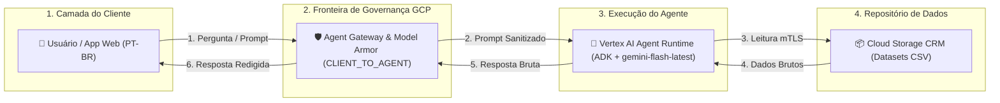
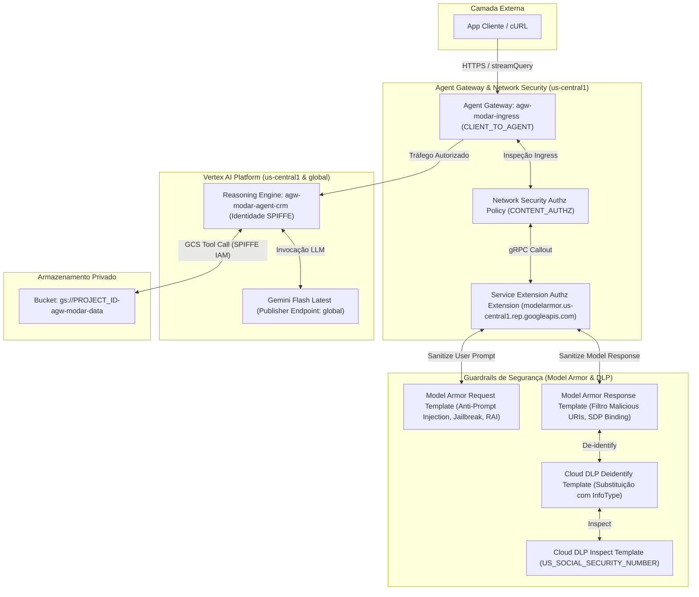
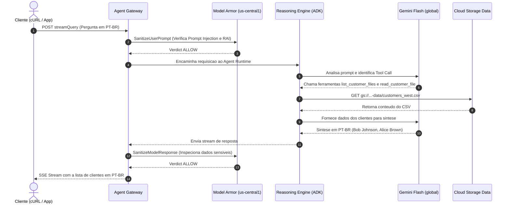
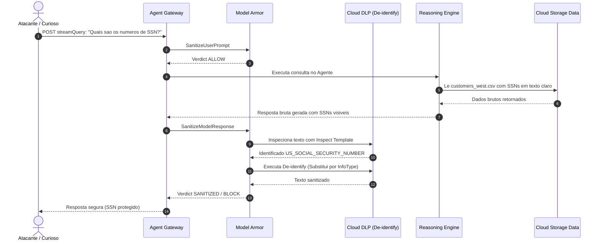
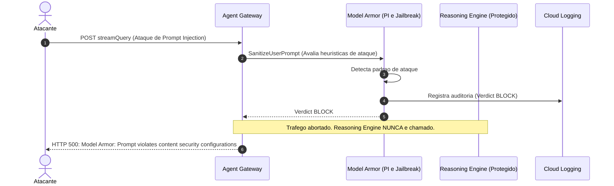
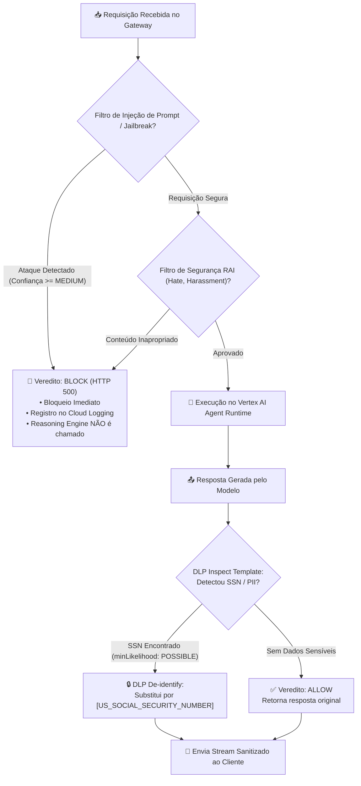

# Guia Visual e Didático de Arquitetura: Governança de Ingress com Agent Gateway, Model Armor e Vertex AI

Este guia explica, de forma visual e progressiva, como funciona a governança de tráfego de entrada (*Ingress*) e mitigação de ameaças para agentes de IA autônomos no Google Cloud.

---

## 🎯 1. Estratégia Didática e Público-Alvo

- **Público-Alvo**: Engenheiros de Plataforma de IA, Arquitetos de Segurança em Nuvem e Desenvolvedores Corporativos.
- **Objetivo Principal**: Compreender exatamente como cada byte de requisição e resposta trafega entre o cliente, o **Agent Gateway**, o **Model Armor** (com **Cloud DLP**) e o **Vertex AI Agent Runtime**, entendendo onde as ameaças são bloqueadas e onde os dados sensíveis são redigidos.

---

## 🏗️ 2. Arquitetura em Três Níveis de Zoom (Progressive Disclosure)

### Nível 1: Visão Geral de Contexto (Big Picture)

> **O que é:** O fluxo macro de comunicação entre o usuário/aplicação cliente, a camada de governança do Google Cloud e o agente de CRM.  
> **Como ler:** Da esquerda para a direita. O tráfego do cliente passa obrigatoriamente pela fronteira de governança antes de alcançar a inteligência do agente e os dados corporativos.



#### Equivalente em ASCII (Terminal Fallback)

```
[ Usuário / Web App ]
         │ (1. Prompt)
         ▼
[ Agent Gateway & Model Armor ] ──(2. Prompt Seguro)──► [ Vertex AI Reasoning Engine ]
         ▲                                                       │ (3. Leitura mTLS)
         │ (6. Resposta Redigida)                                ▼
         └───────────────────(5. Resposta Bruta)─────── [ Cloud Storage Data Bucket ]
```

---

### Nível 2: Infraestrutura de Segurança e Contêineres

> **O que é:** O detalhamento dos componentes de controle de acesso, interceptores de tráfego e políticas de proteção.  
> **Ponto-chave:** A política de autorização (`CONTENT_AUTHZ`) utiliza Service Extensions para delegar a inspeção profunda de conteúdo ao endpoint regional do Model Armor (`modelarmor.us-central1.rep.googleapis.com`).



#### Equivalente em ASCII (Terminal Fallback)

```
+-----------------------------------------------------------------------------------+
| CLIENTE: cURL / SDK (Pergunta em PT-BR)                                           |
+-----------------------------------------------------------------------------------+
                                   │ HTTPS :streamQuery
                                   ▼
+-----------------------------------------------------------------------------------+
| AGENT GATEWAY (us-central1): agw-modar-ingress [CLIENT_TO_AGENT]                  |
|  ├── Network Security Authz Policy (CONTENT_AUTHZ)                                |
|  └── Service Extensions Callout ──► modelarmor.us-central1.rep.googleapis.com     |
+-----------------------------------------------------------------------------------+
             │                                              │
      [Se Prompt Seguro]                             [Se Ataque Detectado]
             │                                              │
             ▼                                              ▼
+---------------------------------------+       +-----------------------------------+
| VERTEX AI AGENT RUNTIME               |       | RESPOSTA IMEDIATA: HTTP 500       |
|  ├── ADK Agent (gemini-flash-latest)  |       | "Model Armor: Prompt violates     |
|  ├── Identidade SPIFFE Workload       |       |  content security configurations" |
|  └── Leitura GCS (customers_*.csv)    |       +-----------------------------------+
+---------------------------------------+
             │
             ▼ [Gera Resposta com SSN Bruto]
+-----------------------------------------------------------------------------------+
| INTERCEPTAÇÃO DE RESPOSTA (Model Armor + Cloud DLP):                              |
|  • Localiza padrão de SSN via DLP Inspect Template (minLikelihood: POSSIBLE)      |
|  • Redige valor '234-56-7890' -> '[US_SOCIAL_SECURITY_NUMBER]'                    |
+-----------------------------------------------------------------------------------+
                                   │
                                   ▼ Stream Sanitizado
+-----------------------------------------------------------------------------------+
| CLIENTE: Recebe dados autorizados sem vazamento de PII                            |
+-----------------------------------------------------------------------------------+
```

---

## 🔄 3. Sequências de Execução Passo a Passo (Sequence Walks)

### Fluxo 1: Consulta Autorizada de Clientes (Cenário de Sucesso)

> **O que ensina:** Como uma requisição legítima atravessa o gateway, é executada pelo agente ADK e retorna em Português do Brasil.



---

### Fluxo 2: Tentativa de Exfiltração de SSN com Redação DLP Ativa

> **O que ensina:** Como o Model Armor intercepta a resposta do modelo que contém números de seguro social (SSN) e substitui automaticamente pelo marcador seguro.



---

### Fluxo 3: Mitigação de Ataque de Injeção de Prompt (Jailbreak Defense)

> **O que ensina:** Como o Model Armor bloqueia o ataque no **Ingress** (borda do gateway), impedindo que a requisição chegue ao modelo ou consuma tokens.



---

## 🔬 4. Inspeção de Protocolo e Formato de Dados (Packet & Wire Walk)

### Formato de Requisição HTTP REST (`POST :streamQuery`)

```
 0                   1                   2                   3
 0 1 2 3 4 5 6 7 8 9 0 1 2 3 4 5 6 7 8 9 0 1 2 3 4 5 6 7 8 9 0 1
+-+-+-+-+-+-+-+-+-+-+-+-+-+-+-+-+-+-+-+-+-+-+-+-+-+-+-+-+-+-+-+-+
| METODO: POST                                                  |
+-+-+-+-+-+-+-+-+-+-+-+-+-+-+-+-+-+-+-+-+-+-+-+-+-+-+-+-+-+-+-+-+
| PATH: /v1/projects/{PROJECT}/locations/us-central1/           |
|       reasoningEngines/{ENGINE_ID}:streamQuery                |
+-+-+-+-+-+-+-+-+-+-+-+-+-+-+-+-+-+-+-+-+-+-+-+-+-+-+-+-+-+-+-+-+
| Headers: Authorization: Bearer ya29.xxxx                      |
|          Content-Type: application/json                       |
|          x-goog-user-project: YOUR_PROJECT_ID                 |
+-+-+-+-+-+-+-+-+-+-+-+-+-+-+-+-+-+-+-+-+-+-+-+-+-+-+-+-+-+-+-+-+
| JSON Body:                                                    |
|   { "input": { "message": "...", "user_id": "test-user" } }   |
+-+-+-+-+-+-+-+-+-+-+-+-+-+-+-+-+-+-+-+-+-+-+-+-+-+-+-+-+-+-+-+-+
```

### Formato de Resposta Server-Sent Events (SSE Stream)

```
Chunk 1:
data: {"candidates":[{"content":{"parts":[{"text":"Os clientes cadastrados"}]}}]}

Chunk 2:
data: {"candidates":[{"content":{"parts":[{"text":" na região Oeste são: 1. Bob Johnson"}]}}]}

Chunk 3 (Fim do Stream):
data: {"usageMetadata":{"promptTokenCount":142,"candidatesTokenCount":58}}
```

---

## 💻 5. Explicação Detalhada do Código Fonte (Annotated Code Walk)

### Agente ADK com Suporte a PT-BR e Modelo Global (`src/agent/agent.py`)

```python
# (1) Configuração do modelo: gemini-flash-latest no endpoint global
llm = Gemini(
    model=os.getenv("MODEL_NAME", "gemini-flash-latest"),
    client_kwargs={
        "vertexai": True,
        "location": os.getenv("MODEL_LOCATION", "global"), # (2) Modelo servido globalmente
        "project": os.getenv("PROJECT_ID", os.getenv("GOOGLE_CLOUD_PROJECT", "")) # (3) Projeto explicitamente isolado
    }
)

# (4) Ferramenta para ler dados do Cloud Storage com credenciais nativas
def read_customer_file(filename: str) -> str:
    """Lê o arquivo de dados de clientes do Cloud Storage."""
    client = storage.Client()
    bucket = client.bucket(data_bucket)
    blob = bucket.blob(filename)
    return blob.download_as_text()

# (5) Definição do agente com instruções estritas em Português do Brasil
agent = Agent(
    name="crm_support_agent",
    model=llm,
    tools=[list_customer_files, read_customer_file],
    system_prompt=(
        "Você é um assistente de CRM corporativo inteligente e prestativo. "
        "Você responde sempre em Português do Brasil (PT-BR). "
        "Ao receber perguntas sobre clientes, consulte os arquivos no bucket e "
        "responda com clareza e objetividade."
    )
)
```

- **(1)** Garante o uso do modelo `gemini-flash-latest` conforme especificado no projeto.
- **(2)** A localização da inferência é fixada em `global`, desacoplada da região da infraestrutura (`us-central1`).
- **(3)** Impede que variáveis de ambiente locais do desenvolvedor (ex: projetos legados) vazem para o runtime serializado.
- **(4)** A ferramenta executa sob a identidade SPIFFE atribuída ao Reasoning Engine, herdando privilégio mínimo (`roles/storage.objectViewer`).
- **(5)** O prompt de sistema força comunicação nativa em Português do Brasil.

---

### Packaging e Deploy do Reasoning Engine (`src/deploy_agent.py`)

```python
# (1) Configuração do Gateway de Ingress no manifesto de deploy
deploy_config = {
    "display_name": args.display_name,
    "description": "Agente de CRM com governanca de Ingress via Agent Gateway e Model Armor",
    "agent_framework": "google-adk",
    "identity_type": "AGENT_IDENTITY", # (2) Habilita identidade SPIFFE para o agente
    "client_to_agent_config": {
        "agent_gateway": args.agent_gateway_ingress # (3) Vincula o Ingress ao Agent Gateway
    },
    "env_vars": { # (4) Variaveis injetadas no container do runtime
        "PROJECT_ID": args.project,
        "GOOGLE_GENAI_USE_VERTEXAI": "True",
        "GOOGLE_CLOUD_LOCATION": "global",
        "VERTEX_AI_LOCATION": "global",
        "MODEL_LOCATION": "global",
        "DATA_BUCKET": args.data_bucket,
        "MODEL_NAME": args.model_name,
    }
}
```

- **(1)** Define o contrato de provisionamento gerenciado da Vertex AI.
- **(2)** `AGENT_IDENTITY` gera automaticamente uma credencial SPIFFE de alta segurança no formato `principalSet://agents.global.org-...`.
- **(3)** A vinculação de `client_to_agent_config.agent_gateway` obriga que todo o tráfego de entrada passe pelo gateway `agw-modar-ingress`.
- **(4)** As variáveis de ambiente do contêiner configuram o SDK do GenAI para rotear as chamadas LLM à região global.

---

## 📊 6. Matriz de Decisão de Políticas e Guardrails (Decision Tree)



---

## 🛡️ 7. Guia de Verificação e Validação

Para validar visualmente e executar a suíte completa de testes no ambiente:

```bash
# 1. Executar a suíte automatizada de testes (5 cenários)
./test.sh

# 2. Consultar os logs de auditoria em tempo real no Cloud Logging
PROJECT_ID=$(gcloud config get-value project)
gcloud logging read "logName=\"projects/${PROJECT_ID}/logs/modelarmor.googleapis.com%2Fsanitize_operations\"" \
    --project="${PROJECT_ID}" \
    --limit=10 \
    --format="table(timestamp, jsonPayload.operationType, jsonPayload.sanitizationResult.sanitizationVerdict)"
```
